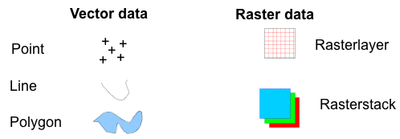
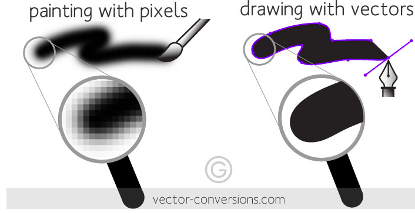

## R Mini Tutorial

## SRE 2019

---

## What is R?

Programming language and environment

 - Statistical computing
 - Graphics
 - GIS and geospatial tools

---

@snap[north-west span -40 text-center]
### Why using R?
@snapend

@snap[mid-west span-55 text-10]
@ul[spaced text-white]
  - Easy
  - Free
  - Community: great variety of packages and cocumentation
@ulend
@snapend

@snap[east span-45]

@snapend

---

### Today's outline

@ol
 - Basic calculations and data types
 - RStudio, environment, reading/writting, basic executions
 - R as a GIS and spatial analysis
@olend[]

---

## Let's start! 

@ol
 - Open https://luiscartor.github.io   and go to the first part of the tutorial
 - Open you computer's terminal
@olend[]

---?color=linear-gradient(100deg, white 50%, #567AD2 50%)

@snap[north-west span -40 text-center]

## @color[black](**RStudio**)

@snapend

@snap[mid-west span-55 text-07]
@ul[spaced text-black]

 - User friendly and free 
 - Integrates R packages, debugging, viewing tools.
 - Best-practice tools: documentation, version control.
 - Useful integrated tools: projects, markdown environment, importing/exporting
 @ulend
 @snapend

@snap[east span-50]

@snapend

---

Please go to the second part of the tutorial: https://luiscartor.github.io/RMT_part2

---?image=assets/img/ccvel2.png

### Geospatial analysis: R as a GIS

- Geostatistics and mapping is core in R
- Many of packages for:
    - Remote sensing preprocessing
    - Spatial analysis
    - Visualization
    
---
@snap[north text-14]
Spatial data types
@snapend

@snap[mid]

@snapend

@snap[south span-40]

@snapend

---?image=assets/img/projections.png

### @color[black](Dealing with map projections)

---

Please go to the third part of the tutorial: https://luiscartor.github.io/RMT_part3
