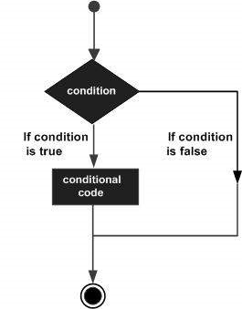
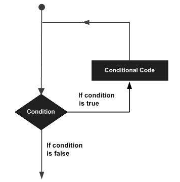

```{r setup, include=FALSE}
knitr::opts_chunk$set(echo = TRUE)
```

#### Go to [part 1](https://luiscartor.github.io/RMT_part1) of the tutorial.

#### Go to [part 3](https://luiscartor.github.io/RMT_part3) of the tutorial.

<br>

## 2.1 The R environment

You should have installed and be familiar with R and RStudio by now. 

In R, we talk about the **workspace** as your current R working environment and includes any user-defined objects (vectors, matrices, data frames, lists, functions). At the end of an R session, the user can save an image of the current workspace that is automatically reloaded the next time R is started.

### 2.1.1 Working directory

By setting the working directory of R, we can directly use relative path to read/write data within this folder.  

For example: an absolute path looks like this:  
`D:/SRE2019/Rtutorial/part2/exercise1/herons.csv`  
if we set the working directory as `D:/SRE2019/Rtutorial/part2`, then the relative path will be:  
`exercise1/herons.csv` 

```{r setup5,message=FALSE,eval=FALSE}
setwd("D:/SRE2019/Rtutorial/part2") # note: the folder should exist, before you set it up.
```

In RStudio, you can set up the working directory in Session>Set Working Directory. 

You can check what your actual working directory is by using the `getwd` command:

```{r,eval=FALSE}
getwd()
```

(Note that if you are using a Microsoft system the file naming convention is different from what we use here. If you want to use a backslash it needs to be escaped, i.e. use two backslashes together)

### 2.1.2 Installing and loading packages

We often need additional functionality beyond those offered by the core R library. In order to install an extension package, you should use install.packages function at the prompt and follow the instructions:

```{r,message=FALSE,warning=FALSE,eval = FALSE}
install.packages("raster") # package for raster analysis
```

It is also possible to use RStudio to install packages. Just go to Tools > Install Packages. Or open the "Packages" tab on the right-bottom window and click Install. 

Now we need to load the package into our session:

```{r, message=FALSE,warning=FALSE,eval = FALSE}
library("raster")
```


For the next lesson on spatial analysis, we will need a bunch of packages. We can install several packages at the same time by creating a vector with each package name as an element. 

```{r ,message=FALSE,warning=FALSE,eval = FALSE}
packages_needed <- c("dismo", # a collection of ENM/SDM tools
                     "rgeos","rgdal","sp", # spatial data analysis
                     "utils", # for zip & unzip files
                     "jsonlite" # necessary for download data from GBIF
                     )
pk_to_install <- packages_needed [!( packages_needed %in% rownames(installed.packages())  )]
if(length(pk_to_install)>0 ){
  install.packages(pk_to_install,repos="http://cran.r-project.org")
}
library("raster")
library("dismo")
library("rgeos")
library("rgdal")
library("sp")
library("utils")
library("jsonlite")

```

Note that we used an `if` statement in the last piece of code. This is telling R to install the packages, only if they hadn't been installed before. We will study the "if" statement in a few minutes.

<br>

> ### Excercise
> Install and load the graphics package *ggplot2*.

<br>

### 2.1.3 Getting help

R includes a comprehensive built-in help system with extensive documentation. You can access the help from the command prompt. Try the following commands:

```{r}
help.start()   # general help
help(lm)      # help about function lm (linear models)
?anova           # same thing as above
example(lm)   # show an example of function anova
```

If you are not sure about the name of the function you are looking for, you can perform a fuzzy search with the apropos function:

```{r}
apropos("anova")
```

```{r,eval = FALSE}
help(anova)
```


<br>

> ### Excercise
> Explore the documentation and examples of the *ggplot2* library. 

<br>

## 2.2 Reading and writing

In R, we can import/read data stored outside the R environment. We can also write data into files which will be stored and accessed by the operating system. R offers options to import many file types formats like txt, csv, excel, etc. Additional packages will allow us to read and write other types of data, such as spatial data. 

### 2.2.1 Reading files

Let's import and read a CSV file. First open your spread sheet software and create a simple table. Give names to the columns and give characters and numerical values. For example:

|heron |	colony | population |
|--- | --- | --- |
|garzetta |	1 | 55 |
|garzetta |	2 | 78 |
|nycticorax|	1 | 25 |
|nycticorax |	3 | 60 |
|alba |	1 | 36 |
|cinerea |	4 | 80 |

Name it herons.csv and save it in your working directory. 

Now we read the file in R:

```{r}
herons <- read.csv(file="herons.csv",head=TRUE,sep=",") # first row contains variable names, comma is separator 
herons
```

We can summarize the new table:

```{r}
summary(herons)
```

You can explore each column using the subsetting tools that you already learn in Part 1:

```{r}
herons$population
herons[1,]
```


### 2.2.2 Writing files

Before learning how to write a file, let's edit the previous table. Let's add an extra row:

```{r}
herons_edit <- rbind(herons, c("alba", 5, 12))
```

Now we write our edited table:

```{r}
write.csv(herons_edit,"herons_edit.csv",row.names = FALSE)
```

Check that the table has been written to disk and import it again to R:

```{r}
new_table <- read.csv(file="herons_edit.csv",head=TRUE,sep=",")
new_table
```

<br>

> ### Excercise
> Use the function `read.table()` to import the herons table. Are there any differences between `read.table()` and `read.csv()`? Use help() to assist you in using this command. 

<br>

## 2.3 Basic executions

Beyond basic arithmetic operations, we will built programs where a piece of code will need to be executed several times, we will need to iterate across some sequence, or we will need to evaluate whether or not a piece of code needs to be run. In this section, we study how to do this.

### 2.3.1 Conditional execution

In order to program pieces of code where we evaluate one or more conditions along some statements to be run, we use decision making statements. If a condition is determined to be true, some statements will be executed.



```{r}
 x = 1
 if( x < 2)
  {
     x <- x + 1
     cat("sums one/n") # prints the action
 }
x
```

The argument in the `if` statement is always a logical expression (see Part 1 for more logical operators). In this code, a unit is summed to x, only if x is smaller than 2. The code will not be run if x is 2 or bigger. 

```{r}
x = 2
 if( x < 2)
  {
     x <- x + 1
     cat("sum one\n") # prints the action
 }
x
```

There exist other decision making statements. An if statement can be followed by an optional else statement, which executes some code when the conditional expression is false.

```{r}
 x = 2
 if ( x == 1)  
 {
    x <- x + 1
    cat("sum one\n")
 } else
 {
    x <- x - 1
    cat("subtract one\n");
 }
 x
```

Several *if statements* can be chained together using `if else`:

```{r}
 x = 1
 if ( x < 2)
 {
    x <- x + 1
    cat("sum one\n")
 } else if ( x < 2.0)
 {
   x <- 2*x
   cat("multiply by 2\n")
 } else
 {
    x <- x - 1
    cat("subtract one\n");
 }
 x
```

<br>

> ### Excercise
> Create a script that calculates the square root of a given object x, only if x is equal or bigger than zero. If x is negative, print a message indicating that this operation is not allowed. 

<br>

### 2.3.2 Loops

Often we need to execute some code a fixed number of times, or we want the code to be repeatedly executed until some condition is met. R provides different loop structures that allow us for simple or more complex execution paths. The general structure of a loop is the following:



The most common is the `for` loop. It is used to repeat some statements, and it is used when you know in advance  the values of the loop variable will have for every iteration of the loop:

```{r}
vec <- seq(from=1,to=10,2)     # a vector is created 
for (i in vec) {               # i is the loop variable
   print(i)                    # the loop iterates across all elements of vec, and prints each element
}
```

A `while` loop executes a statement again and again while a given condition is true:

```{r}
stringvec <- c("herons","are cool")     # a string vector is created
cnt <- 1                                # a counter is created

while (cnt < 5) {                       # while the counter is smaller than 5, the statement will be run
   print(stringvec)
   cnt = cnt + 1
}
```

A `repeat` loop executes a statement again and again until a stop condition is met:

```{r}
stringvec2 <- c("egrets","not so much")
cnt <- 1

repeat {
   print(stringvec2)
   cnt <- cnt+1
   
   if(cnt > 3) {
      break
   }
}
```

Did you notice the difference between the `while` and the `repeat` loops? The `repeat` loop will always begin the loops of statements, but the `while` will only start if the prior condition is true. Also, with a `repeat` loop you have always to specify the condition for when to stop the loop using the `if... break` command. 

<br>

> ### Excercises
> 1. Write a `for` loop that iterates over the numbers 1 to 5 and prints the square of each number. Use the `seq()` function to create the vector and `print()` to print the results. 
> 2. Write a `for` loop that iterates over the numbers -3 to 3 and prints the square root of each number, but only if the numbers are bigger than zero. Use an `if... else` condition inside the loop to do that. If the number is smaller than zero, use the `cat()` function to write a message about the "impossibility" of calculating the square root for negative numbers. 
> 3. Write a while loop that prints out  random normal numbers (use `rnorm()` to create a vector with normal numbers; use `help()` if neccessary) but stops (breaks) if you get a number bigger than 

<br>


## 2.4 Statistical models

Most basic statistical analysis can be performed by using the built-in R functions. Most of these functions take a vector as an argument, together with some parameters, to give the result. Let's check some of the most important ones.

### 2.4.1 Descriptives

R can be easily used to calculate summary statistics, such as mean, sd, range, percentiles, median, etc. 
```{r, eval=FALSE}
normvec <- rnorm(100); normvec                             # a vector with random normal numbers

vec_mean <- mean(normvec); vec_mean                        # mean 
vec_sd <- sd(normvec); vec_sd                              # standard deviation
vec_med <- median(normvec); vec_med                        # median
vec_max <- max(normvec); vec_max                           # maximum value
vec_range <- range(normvec); vec_range                     # range of values
vec_2575q <- quantile(normvec,c(0.25, 0.75)); vec_2575q    #25th and 75th percentiles
```

The `summary` function is very useful to summarize data from many object types, such as vectors, data frames, or linear models. 

```{r}
normvec <- rnorm(100)
summary(normvec)
```


### 2.4.2 Linear regression

We will take a look now at a simple statistical analysis, the linear least square regression. In linear regressions, there is a predictor variable and a response variable, whose value is derived from the predictor variable. The general mathematical equation for a linear regression is `y = ax + b`. a and b are coefficients. 

Once we have gathered a sample of observed values, we can create a relationship model using the `lm()` function in R. We will be able to explore the coefficients created by the model and get a summary of the model to know the error in predictions (residuals). We can use the created model to predict new values of the response variable. 

Let's take the example of the heron colonies. The population size of a heron colony will be the explanatory variable, and the size (diameter of the colony) will be the response variables. We expect a linear relationship between the population and the size. 

```{r}
col_pop <- c(116,78,60,80)         # Population data
col_size <- c(70,43,38,49)         # Colony size data

lmodel <- lm(col_size ~ col_pop)   # The model is created and stored in lmodel
lmodel
```

You can explore what else is stored in the model variable, by using the `attributes` command:

```{r}
attributes(lmodel)
```

We can explore, for example, the model residuals:
```{r}
lmodel$residuals
```


Printing the created linear model, we obtain the used formula, with the coefficients. We can use the `summary` function to obtain more detail about the model:

```{r}
summary(lmodel)
```

The summary provides us with further analysis. For example, we can see the results of a F-test, with the associated p-values.

Finally, we can use the `predict()` function to predict colony size for new colony population data:

```{r}
newpopdata <- data.frame(col_pop=95)             # new collected population data
pred_data <- predict(lmodel,newpopdata)          # model prediction for colony size
pred_data
```

The model predicts a colony diameter of 56.78 for a population of 95 herons. 


## 2.5 Plotting in R

R is known for its strong graphic capabilities. The simplicity of graphs and maps creation is one of the reasons why people love R. Here we will take a look at simple graphs that can be created with the R built-in capabilities. However, there exist a great number of external packages oriented to create beautiful graphs and maps (such as `ggplot2`).

### 2.5.1 Boxplots

Boxplots indicates how the data points are distributed in a data set. A boxplot represents the median, first and third quartiles, together with the minimum and maximum values. Let's create boxplots in R with the `boxplot()` function. To do that, let's create dummy data based on 60 nest sizes of a heron colony for composed of species. 

```{r}
col_species <- rep(c("cinerea","alba","garzetta"),each=20)        # Species of each nest 
nest_size <- c(rnorm(20,mean=95,sd=8),                            # Nest sizes
               rnorm(20,mean=75,sd=12),
               rnorm(20,mean=50,sd=15))
dataset <- data.frame(col_species,nest_size)
```

```{r}
boxplot(nest_size ~ col_species, data=dataset, xlab="Species", ylab="nest_size (cm)",
        main = "Example of boxplot",las=1)
```

You can explore other graphical options using `help()'.

### 2.5.2 Histograms

A histogram represents the frequencies of the values of a variable. Each bar in a histogram represent the number of values present in a specific value range. Let's create a histogram of the nest sizes for *cinerea* using the `hist()` function.

```{r}
nest_cinerea <- dataset[dataset$col_species=="cinerea","nest_size"]    # We subset the dataset to the cinerea nest size values

hist(nest_cinerea, xlab="Nest size", main="Example of histogram")
```

We can specify the number of bars, by breaking the values in narrower ranges. We can also make the graph look better.

```{r}
hist(nest_cinerea, xlab="Nest size", main="Example of histogram", 
     breaks = 10, col = "orange", border = "blue", las=1)
```


### 2.5.3 Scatter plots

A scatter plot graphically represents the relationship between the values of two variables. Let's go back to the heron colony population vs the colony size.

```{r}
col_pop <- c(116,78,60,80,30,42,133)         # Population data
col_size <- c(70,43,38,49,25,21,81)          # Colony size

plot(col_pop, col_size)                      # Scatter plot
```

Let's visually improve this graph:

```{r}
plot(col_pop, col_size, 
     main = "Example of scatter plot", xlab = "Colony population", ylab = "Colony size",
     las=1, pch = 18, cex.axis=1.2, cex.lab=1.2, col="orange") 
```

You can have a look at different plotting parameters [here](https://www.statmethods.net/advgraphs/parameters.html).

<br>


Now we can plot the results of a linear regression model, together with the scatter plot. 

```{r}
lmodel <- lm(col_size ~ col_pop)   # The model is created and stored in lmodel
summary(lmodel)                    # Model results 
```

```{r}
plot(col_pop, col_size, 
     main = "Example of scatter plot", xlab = "Colony population", ylab = "Colony size",
     las=1, pch = 18, cex.axis=1.2, cex.lab=1.2, col="orange") 

abline(lmodel)           # abline() adds a straight line to the current plot
```

`abline()` extracts the coefficients from the linear model to plot a straight line. 


Another useful model visualization process is to plot the residuals of the linear model:

```{r}
plot(col_pop, lmodel$residuals, xlab="Colony population", ylab="Residuals")  # Plot residuals against colony population
abline(0,0)           # Horizon
```


One last important step is to learn how to save plots using the console. There exist several approaches, but one of the simplest ones is to use the family of functions `dev.copy()`:

```{r, eval=FALSE}
plot(col_pop, col_size, 
     main = "Example of scatter plot", xlab = "Colony population", ylab = "Colony size",
     las=1, pch = 18, cex.axis=1.2, cex.lab=1.2, col="orange") 

abline(lmodel)           # abline() adds a straight line to the current plot

dev.copy(png,'scatterplot.png')            # Creates plot png file
dev.off()                                  # Saves plot and closes plotting device
```


### Other plots
There are many other types of plots that are easy to represent in R, such as pie charts, barplots, density graphs, network plots, etc. Another strong advantage of using R is its capabilities for the representation of maps. In the next part of the tutorial, we will explore R capabilities for plotting maps and other spatial data. 

<br>


> ### Excercises
> 1. Type `iris` in your R console and explore the `iris` dataset (built-in in R). Explore the descriptives (mean, sd, quartiles) of the sepal lenghts for each species. Hint: to subset the rows of the to a certain species, use: iris[iris$Species=="name.of.species",].
> 2. Using the `iris` dataset, create a boxplot with the sepal length for each species. Save the plot to disk.
> 3. Using the `iris` dataset, creata a linear regression model for the variation of sepal length against the variation of sepal witdth. Create a scatter plot with those values and plot the regression line. Save the plot to disk.
> 4. AT HOME: explore the library `ggplot2` for graphic creation in R.

<br>

#### Go to the [next section](https://luiscartor.github.io/RMT_part3).